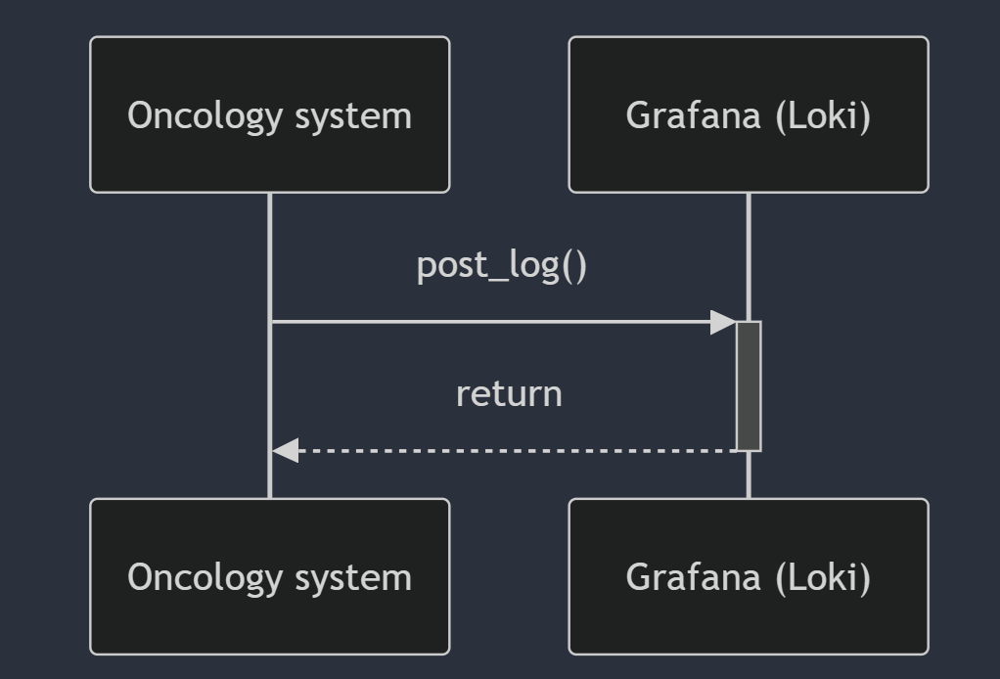

## Oncology Registry Backend

This backend belongs to a patient registry system for the oncology infirmary service. 

The principal responsability of this API is to register the vital signs of the patient in order to analyze them and inform if some value is out of range. This is achieved in order to make give special care and atention to the patient with a minimum response time. 

## Technologies
- Alembic.
- Faker.
- FastAPI.
- Pydantic.
- Pytest
- SQLAlchemy.
- Uvicorn.

## Architecture
This API is developed under a 4 layer architecture:
- Route: The presentation layer.
- Service: The application layer. 
- Domain: Here is defined the bussiness validations.
- Persistence: Wich has the models with the tables definition and repositories that query the DB.

## ER Diagram

## Integrations

## Optional Features (include at least 1): 
1. Make the CRUD operations work for single entities and for batches of entities. 
2. Lock the application dependencies (e.g., pipenv, poetry, pdm). ✅
3. Implement logging throught the codebase to document each step of the process. 
4. Use the Problem Details standard (RFC 9457) to show errors. 
5. Add a middleware to include a autogenerated UUID for correlation id. 
6. Add an endpoint that processes a CSV file, 
7. Implement pagination for some endpoint, possible pagination strategies are: 
    - a. Fixed size pagination i.e., using offset and limit  
    - b. Cursor based pagination. I.e., using page size and page token 
8. Add testing with Pytest: ✅
    - a. Add unit tests, leveraging fixtures, mocks, and patches
    - b. Add integration tests by using a TestClient
    - c. Add tests with the database by leveraging Fakes
9. Use dependency injection to deal with external systems like the DB. ✅
10. Use the repository pattern with Generics to manage queries to the database. ✅
11. Use the inversion of control pattern. 
12. Separate Database entities from Domain entities by leveraging Domain Driven Design. ✅
13. Add quality gates using pre-commits to the codebase: 
    - a. Formatting and Linting with Ruff 
    - b. Linting with Pylint 
    - c. Type checking with Mypy 
14. Make a docker container to easily deploy the application ✅
15. Use a hosted DB (e.g Supabase) 
16. Enhance the retrieve endpoints by adding the possibility to filter records by attributes 
17. Implement rate limitting. 
18. Add a caching methodology to an expensive operation. 
19. Protect the service by using Authentication and Authorization ✅
20. Make the HTTP API RESTFUL following Richardson levels: ✅
    - a. Use HTTP Resources 
    - b. Use HTTP Verbs 
    - c. Implement HATEOAS 
21. Analyse metrics about the application performance (e.g., Apache ab, locust, hey, break, vegeta, 
siege). 
22. Add versioning to the API, that is, having different endpoints for different versions. E.g., /api/v1/ and 
/api/v2/ 
23. Add a simple UI showcasing the service functionality and value. This could be done by using any of 
the following: 
    - a. Python tools that do not require HTML/CSS/JS - e.g., Streamlit. 
    - b. Pure HTML / CSS / JS. 
    - c. Backend-centered libraries for building frontends – e.g., HTMX. 
    - d. Lightweight component libraries – e.g., Lit. 
    - e. Fully Fledge Front-end frameworks/libraries - Angular, React or Vue. 
24. In addition to HTTP REST, add a GraphQL endpoint for querying the data. Provide examples of useful 
queries. 
25. Implement the CQRS pattern 
26. Use a database migration tool (e.g Alembic) ✅